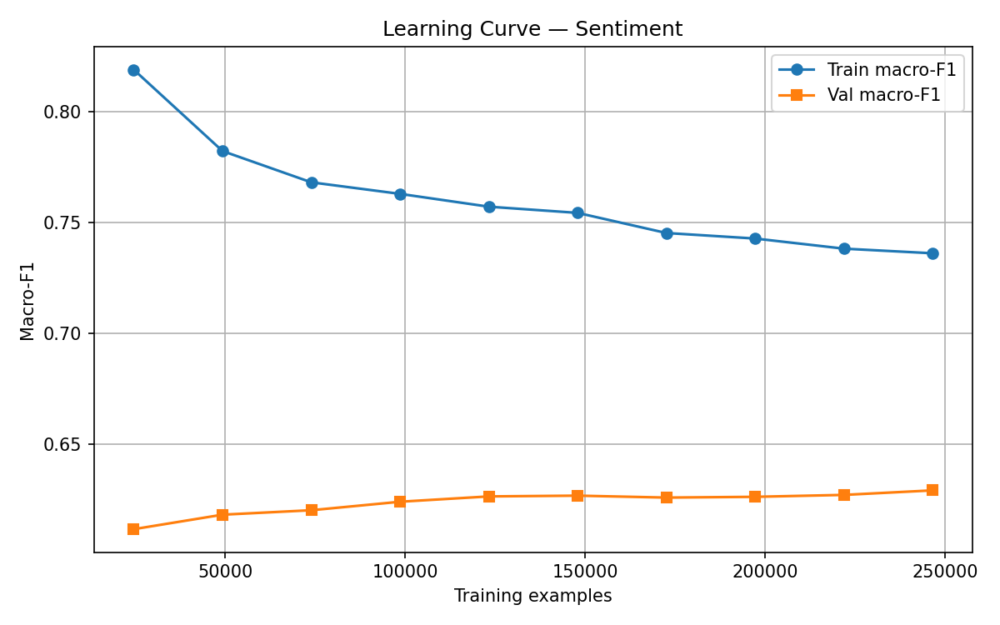

# EVALUATION.md — Sentiment Service

## Models Compared

| Model                    | Val Macro-F1 | Test Macro-F1 | Notes                        |
|--------------------------|-------------|---------------|------------------------------|
| TF-IDF + LR (v1)        | 0.6291      | **0.6241**    | Baseline, class_weight=balanced |
| TahrirchiBERT-small (v1) | 0.6210      | —             | Fine-tuned 3 epochs on GPU   |

## Winner

**TF-IDF + LR** on macro-F1 (0.6241 vs 0.6210). TahrirchiBERT achieved higher
accuracy (90% vs 82%) but severely underpredicted the minority `neutral` class
(F1=0.10 vs 0.22) because standard cross-entropy ignores class imbalance.

## Per-class Results (TF-IDF, Test Set)

| Class    | Precision | Recall | F1   | Support |
|----------|-----------|--------|------|---------|
| negative | 0.71      | 0.78   | 0.75 | 9,822   |
| neutral  | 0.15      | 0.40   | 0.22 | 2,370   |
| positive | 0.97      | 0.85   | 0.91 | 40,631  |
| **macro avg** | 0.61 | 0.68 | **0.62** | 52,823 |

## Learning Curve



**Interpretation:** Val macro-F1 plateaus at ~0.63 after 100k samples and does
not improve with more data. The bottleneck is class imbalance and label
ambiguity in 3-star reviews — not data quantity.

## 3 Interesting Misclassifications

### 1.
- **Text:** `yaxshi`
- **True label:** positive  **Predicted:** neutral
- **Why:** Single word — TF-IDF finds no strong enough signal to commit to positive

### 2.
- **Text:** `yomonmas`
- **True label:** positive  **Predicted:** neutral
- **Why:** Negation of "yomon" (bad). Model reads the root word "yomon" and hedges toward neutral

### 3.
- **Text:** `zo'r soat ekan desam juda ekan , olmanglar`
- **True label:** negative  **Predicted:** neutral
- **Why:** Mixed sentiment — starts with praise ("zo'r"), ends with warning ("olmanglar"). Genuine ambiguity.

## Key Finding

TF-IDF with `class_weight='balanced'` matched a 67M-parameter Uzbek BERT model
on macro-F1. This demonstrates that model complexity is not the bottleneck —
class imbalance is. The correct next step is oversampling the neutral class or
collecting more 3-star reviews.

## How to Reproduce

```bash
pip install -r requirements.txt
python training/prepare_data.py
python training/split_data.py --input data/labelled.csv --output data/
python training/train_tfidf.py --train data/train.csv --val data/val.csv --out models/tfidf_v1.joblib
python training/evaluate.py --model models/tfidf_v1.joblib --type tfidf --test data/test.csv